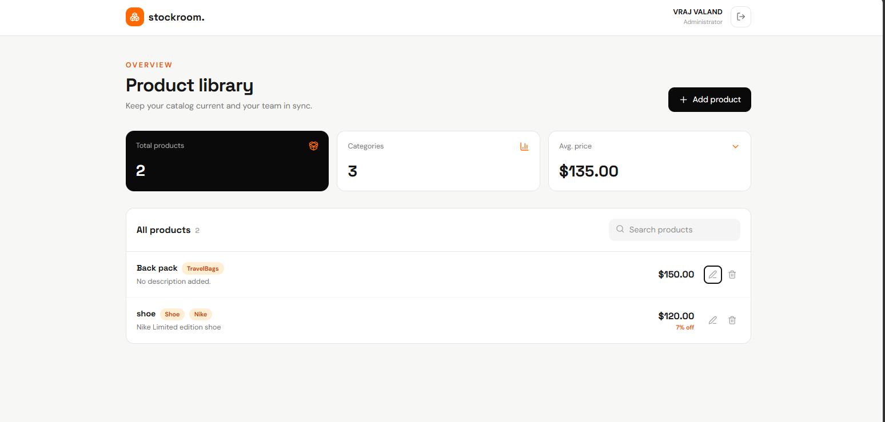

# stockroom.

A full-stack product management app. Sign up, log in, and manage your product catalog from a clean dashboard. Built with the MERN stack and secured with JWT authentication.



## Features

- Signup and login with hashed passwords (bcrypt) and JWT tokens that expire after 1 day
- Protected product API: every product route requires a Bearer token
- Add, edit, and delete products
- Live search across product name, description, and categories
- Dashboard summary: total products, unique categories, and average price
- Discount badge on products that have one
- Toast notifications for success and error messages
- Responsive layout that works on desktop and mobile

## Tech stack

| Layer | Tools |
| --- | --- |
| Frontend | React (Vite), Tailwind CSS, lucide-react, react-hot-toast |
| Backend | Node.js, Express |
| Database | MongoDB with Mongoose |
| Auth | JSON Web Tokens, bcryptjs |

## Project structure

```
project-root/
├── backend/
│   ├── config/
│   │   └── db.js               # MongoDB connection
│   ├── controllers/
│   │   ├── Auth_cntrl.js       # signup, login, logout, protect middleware
│   │   └── Product_cntrl.js    # product CRUD handlers
│   ├── route/
│   │   └── ProductRoute.js     # /api/products routes
│   ├── schema/
│   │   ├── ProductMst.js       # Product model
│   │   └── UserMst.js          # User model
│   ├── .env
│   └── index.js                # server entry point
└── frontend/
    └── src/
        ├── Auth/
        │   ├── Login.jsx
        │   └── Signup.jsx
        ├── hooks/
        │   └── api.js          # API client (useAuth, useProducts)
        ├── App.jsx
        └── App.css
```

## Getting started

### Prerequisites

- Node.js 18 or newer
- MongoDB running locally (`mongodb://localhost:27017`) or a MongoDB Atlas connection string

### 1. Clone the repository

```bash
git clone <your-repo-url>
cd <your-repo-folder>
```

### 2. Set up the backend

```bash
cd backend
npm install
```

Create a file named `.env` in the `backend` folder (the name must start with a dot):

```env
PORT=5000
DB_URL=mongodb://localhost:27017/stockroom
JWT_SECRET=replace_with_a_long_random_string
```

Include a database name at the end of `DB_URL` (here `stockroom`). Without one, MongoDB uses a database called `test`.

Start the server:

```bash
node index.js
```

You should see `MongoDB connected` and `Server running on port 5000`.

### 3. Set up the frontend

```bash
cd frontend
npm install
```

Optionally create a `.env` file in the `frontend` folder if your API runs somewhere other than the default:

```env
VITE_API_URL=http://localhost:5000/api
```

Start the dev server:

```bash
npm run dev
```

Open the URL Vite prints, usually `http://localhost:5173`.

## Environment variables

| Variable | Where | Description | Default |
| --- | --- | --- | --- |
| `PORT` | backend | Port the API listens on | `5000` |
| `DB_URL` | backend | MongoDB connection string | none, required |
| `JWT_SECRET` | backend | Secret used to sign tokens | none, required |
| `VITE_API_URL` | frontend | Base URL of the API | `http://localhost:5000/api` |

Never commit your `.env` file. Add it to `.gitignore`.

## API reference

Base URL: `http://localhost:5000`

### Auth

| Method | Endpoint | Body | Description |
| --- | --- | --- | --- |
| POST | `/api/auth/signup` | `name`, `email`, `password` (min 6 characters) | Create an account and get a token |
| POST | `/api/auth/login` | `email`, `password` | Log in and get a token |
| POST | `/api/auth/logout` | none | Log out |

Signup and login return:

```json
{
  "message": "Login successful",
  "token": "<jwt>",
  "user": { "id": "...", "name": "Vraj", "email": "vraj@example.com" }
}
```

### Products

All product routes need this header:

```
Authorization: Bearer <token>
```

| Method | Endpoint | Description |
| --- | --- | --- |
| GET | `/api/products` | List all products, newest first |
| POST | `/api/products` | Create a product |
| GET | `/api/products/:id` | Get one product |
| PUT | `/api/products/:id` | Update a product |
| DELETE | `/api/products/:id` | Delete a product |

Example request body for create and update:

```json
{
  "name": "shoe",
  "price": 120,
  "discount": 7,
  "categories": ["Shoe", "Nike"],
  "description": "Nike Limited edition shoe"
}
```

`PUT` replaces the product's fields, so send the full body. A missing `discount` resets to `0` and missing `categories` reset to `[]`.

### Product model

| Field | Type | Rules |
| --- | --- | --- |
| `name` | String | required, trimmed |
| `price` | Number | required, minimum 0 |
| `discount` | Number | 0 to 100, default 0 |
| `categories` | [String] | default empty |
| `description` | String | trimmed, default empty |

Timestamps (`createdAt`, `updatedAt`) are added automatically.

### Status codes

| Code | Meaning |
| --- | --- |
| 200 | Success |
| 201 | Created |
| 400 | Invalid data or invalid id |
| 401 | Missing, invalid, or expired token, or wrong login |
| 404 | Product not found |
| 409 | Email already registered |
| 500 | Server error |

## Troubleshooting

- **`DB_URL is not configured`**: your env file must be named exactly `.env`, not `_env` or `env`.
- **Product create or update returns 400 with "name is required"**: the request is reaching the server without `Content-Type: application/json`. Check the headers merge in `frontend/src/hooks/api.js`.
- **Changes don't show up on `localhost:4173`**: that port is `vite preview`, which serves the old build. Use `npm run dev`, or run `npm run build` again.
- **Port already in use**: stop the other backend process, or change `PORT` in `.env`.

## Author

Vraj Valand